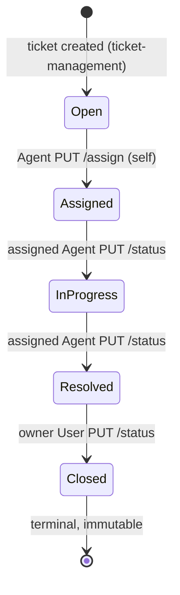

# Ticket Workflow — Module Specification

| Item | Value |
|---|---|
| Module | `ticket-workflow` (ID prefix `WF`) |
| REQ IDs owned | REQ-030, REQ-031, REQ-032, REQ-033, REQ-034, REQ-035, REQ-036, REQ-037, REQ-038, REQ-062 |
| Source document | `requirement.md` (draft for review) |
| Status | Draft for review — behaviours that depend on an open question are marked **Provisional** |

> Conventions: `A-xx` = working assumption, `OQ-xx` = open question, `BR-x` = business rule (all defined in `requirement.md`). `TBD / Requires clarification` = the client text is silent. Error code names (e.g. `INVALID_TRANSITION`), JSON field names (camelCase) and the exact-case status strings are **Provisional** and depend on OQ-26.

## 1. Module Overview

The `ticket-workflow` module governs how a ticket moves through its lifecycle `Open → Assigned → In Progress → Resolved → Closed`, who may trigger each move, and how every move is audited. It comprises the assignment endpoint, the status-change endpoint, the status state machine, the User "Close ticket" action, the Agent "Update Ticket" screen (status and assignment controls), the Closed-ticket write lock, and the `ticket_history` audit trail with its display on Ticket Details.

## 2. Objective

- Enforce the client lifecycle and business rules BR-4 to BR-9 on the server, independent of the UI.
- Guarantee that every successful status change is recorded in `ticket_history` (actor, from, to, time) in the same transaction as the ticket update, and that history is append-only.
- Make a Closed ticket immutable across all write endpoints.
- Offer each role only the actions that are valid for the current ticket state.

## 3. Scope

**In scope**

- `PUT /api/tickets/{id}/assign` (A-01) and `PUT /api/tickets/{id}/status` (A-02, A-03, A-04, A-05).
- The status state machine and transition permissions per role.
- User "Close ticket" action on Ticket Details; Agent "Assign to me" action; Agent "Update Ticket" screen status/assign controls and the status options offered per role and state.
- Closed-ticket immutability on `PUT /api/tickets/{id}`, `/status` and `/assign` (BR-6).
- `ticket_history` recording; proposed `GET /api/tickets/{id}/history` (OQ-26); History section of Ticket Details (OQ-24).
- `tickets.status`, `tickets.assigned_to`, `tickets.updated_at` behaviour.
- Atomicity and append-only integrity (REQ-062).

**Out of scope (cross-reference only)**

| Item | Owning module |
|---|---|
| Ticket creation, listing, search/filter/sort/pagination, field validation, field edits (content of `PUT /api/tickets/{id}`) | `ticket-management` |
| Login, token handling, role claim | `authentication` |
| Adding/listing comments, comment blocking on Closed tickets (A-06) | `comments` |
| Dashboard counts and recent tickets | `dashboard` |
| Ticket deletion (OQ-04), reopen (OQ-06, OQ-13), reassignment to another agent (OQ-05) | Not supported until clarified |

## 4. Actors / User Roles

| Actor | Definition | Relevant permissions in this module |
|---|---|---|
| Owner User | A User who created the ticket (`tickets.user_id` = caller) | Close own Resolved ticket (REQ-035); view own ticket history (OQ-24, Provisional) |
| Non-owner User | A User who did not create the ticket | None (A-05); treated as forbidden (403, or 404 per OQ-27) |
| Assigned Agent | Support Agent equal to `tickets.assigned_to` | Move Assigned → In Progress → Resolved (A-05) |
| Other Agent | Support Agent not equal to `tickets.assigned_to` | May self-assign an **unassigned Open** ticket; may view; may not change status of another agent's ticket (A-05, OQ-17) |
| Unauthenticated caller | No valid token | Rejected with 401 on every endpoint (REQ-003) |

Provisional seed accounts used in this document set (`Provisional seed data`): `user1@helpdesk.test` (id 1), `user2@helpdesk.test` (id 2), `agent1@helpdesk.test` (id 3), `agent2@helpdesk.test` (id 4).

## 5. Functional Requirements

| ID | Description | REQ ref |
|---|---|---|
| WF-FR-01 | A ticket status is exactly one of `Open`, `Assigned`, `In Progress`, `Resolved`, `Closed`. A new ticket starts as `Open` (set by `ticket-management`). | REQ-030 |
| WF-FR-02 | The server enforces the transition table in Section 7. Only these forward, single-step transitions are accepted: Open → Assigned, Assigned → In Progress, In Progress → Resolved, Resolved → Closed (A-02; Provisional, OQ-06). | REQ-030, REQ-031 |
| WF-FR-03 | Any other requested transition (skip, backward/reopen, same-status, out of Closed) is rejected with HTTP 409 and an error message naming the current and requested status; ticket, history and `updated_at` are unchanged. | REQ-031 |
| WF-FR-04 | A User cannot move a ticket from Open directly to Closed; the request is rejected (BR-8). | REQ-031 |
| WF-FR-05 | `PUT /api/tickets/{id}/assign` lets a Support Agent assign an `Open` ticket to **themselves**, setting `assigned_to` = caller and status = `Assigned` (A-01; Provisional, OQ-05). | REQ-032 |
| WF-FR-06 | Assign is accepted only when the ticket is `Open`. Already-assigned or later-state tickets are rejected with 409 (A-01; reassignment is TBD / Requires clarification, OQ-05). | REQ-032 |
| WF-FR-07 | The assign endpoint never assigns the ticket to an agent other than the caller; a client-supplied assignee is ignored or rejected (A-01, OQ-05). | REQ-032, REQ-033 |
| WF-FR-08 | A caller with role User receives 403 from `PUT /assign` (BR-4) and the ticket is unchanged. | REQ-033 |
| WF-FR-09 | `PUT /api/tickets/{id}/status` lets the **assigned** Support Agent move Assigned → In Progress and In Progress → Resolved (A-02, A-05). | REQ-034 |
| WF-FR-10 | `Assigned` is not an accepted target of `PUT /status`; it is reached only through `/assign` (A-03; Provisional, OQ-07). | REQ-034, REQ-032 |
| WF-FR-11 | Only role Support Agent may set `Resolved`; a User requesting it receives 403 (BR-5). | REQ-034 |
| WF-FR-12 | An Agent who is not the assigned agent receives 403 when changing status (A-05; Provisional, OQ-17). | REQ-034 |
| WF-FR-13 | A Support Agent cannot set `Closed`; the request receives 403 (A-04; Provisional, OQ-13). | REQ-034, REQ-035 |
| WF-FR-14 | The owner User can move a `Resolved` ticket to `Closed` through `PUT /status` with `{"status":"Closed"}` (BR-9). | REQ-035 |
| WF-FR-15 | A User may request only `Closed`; any other target from a User receives 403. A Non-owner User receives 403 for every request (A-05; 404 variant per OQ-27). | REQ-035, REQ-033 |
| WF-FR-16 | A `Closed` ticket rejects every write: `PUT /api/tickets/{id}`, `PUT /status`, `PUT /assign` (BR-6). Nothing on the ticket, its history or `updated_at` changes. Comment blocking is specified in the `comments` module (A-06, OQ-23). | REQ-036 |
| WF-FR-17 | Every successful assign and status change inserts exactly one `ticket_history` row (ticket, from-status, to-status, actor, timestamp) (BR-7). | REQ-037 |
| WF-FR-18 | `changed_by` is the authenticated actor; `changed_at` is generated by the server in UTC and cannot be supplied by the client (A-12, A-14). | REQ-037 |
| WF-FR-19 | Rejected requests (400, 401, 403, 404, 409, 500) create no `ticket_history` row. Ticket creation creates none either (A-13; Provisional, OQ-21). | REQ-037 |
| WF-FR-20 | `GET /api/tickets/{id}/history` returns the ticket's history in chronological order (oldest first) (proposed endpoint, OQ-26). | REQ-038 |
| WF-FR-21 | Ticket Details shows a History section listing each change as from-status → to-status, actor and timestamp in chronological order. Visibility per role: TBD / Requires clarification (OQ-24); Provisional: Owner User and all Agents. | REQ-038 |
| WF-FR-22 | The status update, the `assigned_to` update (assign only), the `updated_at` update and the `ticket_history` insert occur in one database transaction; a failure of any part rolls back all parts. | REQ-062 |
| WF-FR-23 | `ticket_history` is append-only: no endpoint and no application database privilege allows UPDATE or DELETE of its rows (Provisional; enforcement mechanism TBD). | REQ-062 |
| WF-FR-24 | `tickets.updated_at` is set to the server time on every successful assign or status change and is unchanged by rejected requests. | REQ-062 |
| WF-FR-25 | Concurrent conflicting requests on the same ticket are serialised: exactly one succeeds and the others receive 409; the final state equals one valid sequential outcome and has exactly one history row per successful change. | REQ-062, REQ-031 |
| WF-FR-26 | Ticket Details offers only valid actions: "Assign to me" (Agent, status Open); Update Ticket status options (assigned Agent, states Assigned and In Progress); "Close ticket" (owner User, status Resolved). No action is offered on a Closed ticket. | REQ-032, REQ-034, REQ-035, REQ-036 |
| WF-FR-27 | The Update Ticket screen lists only the single valid next status for the assigned Agent (Assigned → In Progress; In Progress → Resolved). It never lists `Assigned`, `Open` or `Closed` as a status option. | REQ-034, REQ-031 |
| WF-FR-28 | The `status` request value must be one of the five exact-case status strings; null, empty, missing, wrongly typed or unknown values return 400 with a field-level detail. | REQ-034 |
| WF-FR-29 | All endpoints require authentication; an invalid or missing token returns 401 (REQ-003). | REQ-033, REQ-034 |
| WF-FR-30 | Error responses follow the provisional error contract (Section 9 and requirement.md Section 14) and the UI shows a user-friendly message for each. | REQ-031, REQ-034 |

## 6. Business Rules

| Rule | Text (client wording) | How it applies in this module |
|---|---|---|
| BR-4 | Only Support Agents can assign tickets. | `/assign` returns 403 to any User. Agents may only assign to themselves (A-01); assigning to a different agent is TBD (OQ-05). |
| BR-5 | Only Support Agents can move a ticket to Resolved. | A User requesting `Resolved` gets 403 regardless of ticket state. The Agent must additionally be the assigned agent (A-05) and the ticket must be `In Progress`. |
| BR-6 | A closed ticket cannot be edited. | `PUT /api/tickets/{id}`, `/status`, `/assign` return 409 `TICKET_CLOSED` for a permitted caller. Whether comments/attachments are also blocked: see `comments` module and OQ-23. |
| BR-7 | Every status change should be recorded in `ticket_history`. | One row per successful assign or status change, written in the same transaction (REQ-062). None for rejected requests. |
| BR-8 | The user must not be able to directly change Open to Closed. | Owner User sending `Closed` on an `Open` ticket gets 409 `INVALID_TRANSITION`; the UI never shows "Close ticket" on an Open ticket. |
| BR-9 | A User can only close a resolved ticket. | Owner User may send `Closed` only when status is `Resolved`; in any other state the request is rejected (409, or 403 for Non-owner). |

Check order (Provisional, OQ-26): 1) authentication (401); 2) ticket exists (404); 3) request-body validation (400); 4) role and ownership/assignment (403); 5) Closed lock and transition rule (409). Consequences: an unknown status string (for example `Done`) yields 400 for every role; a role violation is reported as 403 even if the transition would also be invalid (for example a User requesting `Resolved` on an Open ticket); and an Agent requesting `Closed` on a Closed ticket receives 403, not 409.

## 7. User Flow

### 7.1 State diagram



ASCII equivalent (`InProgress` = `In Progress`):

```
 Open --(Agent: PUT /assign)--> Assigned --(assigned Agent: /status)--> In Progress
                                                                           |
                                                          (assigned Agent: /status)
                                                                           v
 Closed (terminal) <--(owner User: /status)-- Resolved  <------------------+
```

Not allowed (A-02, OQ-06): skipping a step, moving backward/reopening, same-status update, any change out of Closed, `Assigned` via `/status` (A-03).

### 7.2 Transition table (every from-status x to-status x role)

Cell values: `Allowed` = 200; `403` = FORBIDDEN; `409 ...` = conflict; `n/a` = actor cannot exist in that state. The table applies to requests already past authentication, ticket lookup and body validation (see check order in Section 6). "Other Agent" on an unassigned Open ticket has no assignee to conflict with, so only the transition rule decides (OQ-17, Provisional). Non-owner User outcome may be 404 instead of 403 (OQ-27).

| From | To | Mechanism | Owner User | Non-owner User | Assigned Agent | Other Agent (or any Agent on unassigned Open) |
|---|---|---|---|---|---|---|
| Open | Assigned | `PUT /assign` (A-01) | 403 | 403 | n/a (no assignee) | Allowed (self-assign; assignee = caller) |
| Open | Open | `PUT /status` | 403 | 403 | n/a (no assignee) | 409 INVALID_TRANSITION |
| Open | Assigned | `PUT /status` (A-03: not a valid target) | 403 | 403 | n/a (no assignee) | 409 INVALID_TRANSITION |
| Open | In Progress | `PUT /status` | 403 | 403 | n/a (no assignee) | 409 INVALID_TRANSITION |
| Open | Resolved | `PUT /status` | 403 | 403 | n/a (no assignee) | 409 INVALID_TRANSITION |
| Open | Closed | `PUT /status` | 409 INVALID_TRANSITION | 403 | n/a (no assignee) | 403 |
| Assigned | Open | `PUT /status` | 403 | 403 | 409 INVALID_TRANSITION | 403 |
| Assigned | Assigned | `PUT /status` | 403 | 403 | 409 INVALID_TRANSITION | 403 |
| Assigned | In Progress | `PUT /status` | 403 | 403 | Allowed | 403 |
| Assigned | Resolved | `PUT /status` | 403 | 403 | 409 INVALID_TRANSITION | 403 |
| Assigned | Closed | `PUT /status` | 409 INVALID_TRANSITION | 403 | 403 | 403 |
| In Progress | Open | `PUT /status` | 403 | 403 | 409 INVALID_TRANSITION | 403 |
| In Progress | Assigned | `PUT /status` | 403 | 403 | 409 INVALID_TRANSITION | 403 |
| In Progress | In Progress | `PUT /status` | 403 | 403 | 409 INVALID_TRANSITION | 403 |
| In Progress | Resolved | `PUT /status` | 403 | 403 | Allowed | 403 |
| In Progress | Closed | `PUT /status` | 409 INVALID_TRANSITION | 403 | 403 | 403 |
| Resolved | Open | `PUT /status` | 403 | 403 | 409 INVALID_TRANSITION | 403 |
| Resolved | Assigned | `PUT /status` | 403 | 403 | 409 INVALID_TRANSITION | 403 |
| Resolved | In Progress | `PUT /status` | 403 | 403 | 409 INVALID_TRANSITION | 403 |
| Resolved | Resolved | `PUT /status` | 403 | 403 | 409 INVALID_TRANSITION | 403 |
| Resolved | Closed | `PUT /status` | Allowed | 403 | 403 | 403 |
| Closed | Open | `PUT /status` | 403 | 403 | 409 TICKET_CLOSED | 403 |
| Closed | Assigned | `PUT /status` | 403 | 403 | 409 TICKET_CLOSED | 403 |
| Closed | In Progress | `PUT /status` | 403 | 403 | 409 TICKET_CLOSED | 403 |
| Closed | Resolved | `PUT /status` | 403 | 403 | 409 TICKET_CLOSED | 403 |
| Closed | Closed | `PUT /status` | 409 TICKET_CLOSED | 403 | 403 | 403 |

### 7.3 Main flows

1. **Happy path:** User creates ticket (Open) → Agent opens Ticket Details, clicks "Assign to me" (Assigned) → Agent opens Update Ticket, selects In Progress → Agent selects Resolved → User opens Ticket Details, clicks "Close ticket" (Closed). Four history rows are written (Open→Assigned, Assigned→In Progress, In Progress→Resolved, Resolved→Closed).
2. **Rejected path:** any request not in the table is answered with the error in Section 12; UI re-fetches the ticket and shows the current valid actions.

## 8. UI Requirements

Screens: Ticket Details (both roles) and Update Ticket (Agent), per REQ-070. Stable element identifiers: TBD (REQ-063). Wording of buttons below is Provisional.

| ID | Requirement |
|---|---|
| WF-UI-01 | Ticket Details shows the current status, the assignee (name) or "Unassigned", and a History section (Section 8.2). |
| WF-UI-02 | Agent, status `Open`: "Assign to me" is shown. In every other status it is hidden. User never sees it. |
| WF-UI-03 | Owner User, status `Resolved`: "Close ticket" is shown. In every other status, and for non-owner Users and Agents, it is hidden. A confirmation dialog is TBD (not specified by client). |
| WF-UI-04 | Update Ticket is available to Agents only. A User navigating to it directly is denied or redirected (REQ-002). |
| WF-UI-05 | Update Ticket, assigned Agent: status Assigned offers only "In Progress"; status In Progress offers only "Resolved"; status Resolved and Closed offer no status option. `Open`, `Assigned` and `Closed` are never offered as targets. |
| WF-UI-06 | Update Ticket, Agent who is not the assignee, or ticket Open (unassigned): status controls are hidden or disabled with an explanatory message (A-05). |
| WF-UI-07 | Closed ticket: all workflow controls hidden; a read-only indicator is shown. Editing of other fields is handled by `ticket-management` and must also be unavailable (BR-6). |
| WF-UI-08 | Submit buttons (Assign to me, Update, Close ticket) are disabled while a request is in flight to prevent double submission. |
| WF-UI-09 | After success, the page shows the new status, assignee and a new History entry without a manual reload. |
| WF-UI-10 | On 409 the page shows a message that the ticket changed, reloads the ticket and re-evaluates the offered actions. On 401 the user is redirected to Login. On 403 and 500 a friendly message is shown (REQ-064). |

### 8.2 History section

Chronological list (oldest first); each entry: from-status → to-status, actor name (and role), timestamp shown in the viewer's local time zone (A-12; format TBD, OQ-20). An Open ticket with no changes shows an empty-state text (wording TBD). Role visibility: TBD / Requires clarification (OQ-24); Provisional: Owner User (own ticket) and all Agents.

## 9. API Requirements

All requests: `Authorization: Bearer <token>` (A-11), `Content-Type: application/json`. Provisional seed ids: see Section 4.

Provisional error contract (requirement.md Section 14): `{ "status": <http>, "error": "<CODE>", "message": "<text>", "details": [{ "field": "...", "message": "..." }] }`. Error codes used here (names Provisional, OQ-26): `VALIDATION_ERROR`, `UNAUTHORIZED`, `FORBIDDEN`, `NOT_FOUND`, `INVALID_TRANSITION`, `TICKET_CLOSED`, `INTERNAL_ERROR`.

### 9.1 PUT /api/tickets/{id}/assign

| Item | Value |
|---|---|
| Method / path | `PUT /api/tickets/{id}/assign` |
| Caller | Support Agent |
| Request body | None required (A-01: assignee = caller). Any `assignedTo` supplied is ignored or rejected with 400; it is never honoured for another agent (OQ-05). |
| Effect | Ticket must be `Open`; sets `assigned_to` = caller, status `Assigned`, `updated_at` = now, inserts history row Open → Assigned. |

Success `200 OK`:

```json
{
  "id": 1,
  "ticketNumber": 1001,
  "status": "Assigned",
  "assignedTo": { "id": 3, "name": "Agent One" },
  "updatedAt": "2026-10-07T10:00:00Z"
}
```

| Condition | HTTP | `error` |
|---|---|---|
| Missing/invalid token | 401 | `UNAUTHORIZED` |
| Caller is a User | 403 | `FORBIDDEN` |
| Ticket not found / id not numeric | 404 / 400 | `NOT_FOUND` / `VALIDATION_ERROR` |
| Ticket not `Open` (already assigned, In Progress, Resolved) | 409 | `INVALID_TRANSITION` |
| Ticket `Closed` | 409 | `TICKET_CLOSED` |
| Unexpected failure (transaction rolled back) | 500 | `INTERNAL_ERROR` |

### 9.2 PUT /api/tickets/{id}/status

| Item | Value |
|---|---|
| Method / path | `PUT /api/tickets/{id}/status` |
| Callers | Assigned Agent (In Progress, Resolved); owner User (Closed) |
| Request body | `{ "status": "In Progress" }` — required, one of `Open`, `Assigned`, `In Progress`, `Resolved`, `Closed` (exact case, Provisional). Other properties are ignored; they never change `assigned_to` or `updated_at` directly. |

Success `200 OK`:

```json
{
  "id": 3,
  "ticketNumber": 1003,
  "status": "Resolved",
  "assignedTo": { "id": 3, "name": "Agent One" },
  "updatedAt": "2026-10-07T11:30:00Z"
}
```

Error example `409 Conflict`:

```json
{
  "status": 409,
  "error": "INVALID_TRANSITION",
  "message": "Cannot change status from 'Open' to 'Closed'.",
  "details": []
}
```

| Condition | HTTP | `error` |
|---|---|---|
| Missing/invalid token | 401 | `UNAUTHORIZED` |
| Body missing, malformed, `status` null/empty/unknown/lowercase/wrong type | 400 | `VALIDATION_ERROR` (detail field `status`) |
| Ticket not found | 404 | `NOT_FOUND` |
| User requests anything but `Closed`; Non-owner User; Agent requests `Closed`; Agent is not the assignee (ticket assigned) | 403 | `FORBIDDEN` |
| Invalid, same-status or backward transition; `Assigned` target; skip | 409 | `INVALID_TRANSITION` |
| Ticket already `Closed` | 409 | `TICKET_CLOSED` |
| Unexpected failure (rolled back) | 500 | `INTERNAL_ERROR` (generic message, no stack trace) |

### 9.3 Closed-ticket lock on PUT /api/tickets/{id}

Request/response contract of `PUT /api/tickets/{id}` belongs to `ticket-management` (OQ-03). This module adds one rule: when the ticket is `Closed`, the endpoint returns 409 `TICKET_CLOSED` for a permitted caller, 403 for a Non-owner User, and never 200; for an Agent the outcome is 403 or 409 depending on OQ-03, never 200. The body can never change `status` or `assigned_to` (A-07).

### 9.4 GET /api/tickets/{id}/history (proposed, OQ-26)

Callers: Owner User (Provisional) and any Agent (OQ-24). Non-owner User: 403 (or 404, OQ-27).

Success `200 OK` (oldest first; `[]` when the ticket has no changes):

```json
[
  { "id": 101, "ticketId": 1, "fromStatus": "Open", "toStatus": "Assigned",
    "changedBy": { "id": 3, "name": "Agent One", "role": "AGENT" },
    "changedAt": "2026-10-07T10:00:00Z" },
  { "id": 102, "ticketId": 1, "fromStatus": "Assigned", "toStatus": "In Progress",
    "changedBy": { "id": 3, "name": "Agent One", "role": "AGENT" },
    "changedAt": "2026-10-07T10:15:00Z" }
]
```

Errors: 401 unauthenticated; 403 Non-owner User (OQ-24, OQ-27); 404 ticket not found. No `POST`, `PUT`, `PATCH` or `DELETE` exists on this resource (append-only); such methods return 404 or 405.

## 10. Database Requirements

**`tickets`** (client-specified columns): `status` (restricted to the five values, NOT NULL, default `Open`), `assigned_to` (nullable FK → `users.id`, NULL until assigned; set only by assign), `updated_at` (UTC timestamp, set on every successful change; `created_at` is never modified by this module).

**`ticket_history`** (proposed, not client-specified; requires confirmation):

| Column | Type / constraint |
|---|---|
| `id` | Primary key, auto-generated |
| `ticket_id` | NOT NULL, FK → `tickets.id` |
| `from_status` | NOT NULL, restricted to the five values (creation is not logged, A-13) |
| `to_status` | NOT NULL, restricted to the five values |
| `changed_by` | NOT NULL, FK → `users.id` (acting user, A-14) |
| `changed_at` | NOT NULL, UTC, server-generated default (A-12, A-14) |

- **Transaction / atomicity (REQ-062):** the lock/read of the ticket row, validation of the transition, the `tickets` update (`status`, `assigned_to` for assign, `updated_at`) and the `ticket_history` insert run in one transaction. The ticket row is locked (or an optimistic status-conditional UPDATE is used) so concurrent requests are serialised. Any failure rolls back everything.
- **Append-only:** the application database account has INSERT and SELECT only on `ticket_history`; UPDATE and DELETE are not granted (or are blocked by trigger). Provisional; enforcement mechanism TBD. Behaviour when a ticket is deleted (OQ-04) is TBD.
- **Indexes (proposed):** `ticket_history (ticket_id, changed_at)` for chronological retrieval; index on `ticket_history (changed_by)`; `tickets (status)` and `tickets (assigned_to)` for list/dashboard queries.
- **Ordering:** history is returned by `changed_at` ascending, ties broken by `id` ascending.

## 11. Validation Rules

| Field | Rule |
|---|---|
| Path `id` | Positive integer (A-09); non-numeric returns 400 (Provisional, OQ-26); non-existing returns 404. |
| `status` (body) | Required; string; exactly one of `Open`, `Assigned`, `In Progress`, `Resolved`, `Closed` (case-sensitive and without leading/trailing spaces — Provisional, OQ-26). Null, empty, array, number, object, unknown or lowercase variants are rejected with 400. |
| Body | Valid JSON object required for `/status`; none required for `/assign`. |
| Transition | Must be in the Section 7.2 table for the caller's role (Section 6 check order). |
| Client-supplied `changedAt`, `changedBy`, `updatedAt`, `assignedTo` | Never trusted; ignored (or rejected with 400 for `assignedTo` on `/assign`, OQ-05). |

## 12. Error Scenarios

| # | Scenario | HTTP | `error` | Ticket / history effect |
|---|---|---|---|---|
| 1 | No token / invalid / expired token | 401 | `UNAUTHORIZED` | None |
| 2 | User calls `/assign` | 403 | `FORBIDDEN` | None |
| 3 | User requests `Resolved` (or any non-`Closed` status) | 403 | `FORBIDDEN` | None |
| 4 | Non-owner User requests any status/history | 403 (or 404, OQ-27) | `FORBIDDEN` | None |
| 5 | Agent requests `Closed` | 403 | `FORBIDDEN` | None |
| 6 | Agent changes status on another agent's ticket | 403 | `FORBIDDEN` | None |
| 7 | Open → Closed, skip, backward, same-status, `Assigned` via `/status` | 409 | `INVALID_TRANSITION` | None |
| 8 | Assign a ticket that is not `Open` | 409 | `INVALID_TRANSITION` | None |
| 9 | Any write on a Closed ticket | 409 | `TICKET_CLOSED` | None |
| 10 | Invalid/missing/null/lowercase `status`, malformed JSON, non-numeric id | 400 | `VALIDATION_ERROR` | None |
| 11 | Ticket id does not exist | 404 | `NOT_FOUND` | None |
| 12 | Concurrent request lost the race | 409 | `INVALID_TRANSITION` | Only the winner's change persists |
| 13 | History insert or ticket update fails | 500 | `INTERNAL_ERROR` | Full rollback; generic message, no stack trace/SQL/PII |

## 13. Security / Permission Requirements

- Server-side authorisation on every endpoint in this module: role (BR-4, BR-5), ownership (owner User), assignment (assigned Agent, A-05) — never UI-only (REQ-002).
- Authentication required (REQ-003); 401 on missing/invalid/expired/tampered token.
- Client-supplied actor or time values (`changedBy`, `changedAt`, `updatedAt`) are ignored; the actor is taken from the token (REQ-060).
- Object-level access: a User cannot read or change another User's ticket or its history by changing `{id}` (403 or 404, OQ-27).
- Error bodies for 500 expose no stack trace, SQL text or personal data (REQ-060, REQ-064).
- Parameterised queries only; status values are validated against the fixed set before use (SQL injection).
- History is tamper-resistant: append-only at API and database-privilege level (REQ-062).

## 14. Dependencies

| Depends on | Module / source | Dependency |
|---|---|---|
| Authenticated identity and role claim | `authentication` (REQ-001, REQ-002, REQ-003, A-11) | Token carries user id and role |
| Ticket records in status `Open` with `user_id`, `status`, `assigned_to`, `updated_at` | `ticket-management` (REQ-012) | Initial status and ticket row structure; ticket lookup |
| `PUT /api/tickets/{id}` content and editable fields | `ticket-management` (REQ-017, OQ-03) | This module only adds the Closed lock and the rule that status/assignee are not editable there |
| Closed-ticket comment blocking | `comments` (A-06, OQ-23) | Tested there |
| Status counts | `dashboard` (REQ-050) | Consumes status changes made here |
| Seed users (2 Users, 2 Agents) | A-08, `users` table | Required for tests |
| Open questions | OQ-03, OQ-05, OQ-06, OQ-07, OQ-13, OQ-17, OQ-21, OQ-23, OQ-24, OQ-26, OQ-27 | Provisional behaviours |

## 15. Acceptance Criteria

| ID | Criterion | REQ |
|---|---|---|
| WF-AC-01 | An Agent can assign an `Open` ticket to themselves: response 200, status `Assigned`, `assigned_to` = caller, one history row Open → Assigned. | REQ-032, REQ-037 |
| WF-AC-02 | A User calling `/assign` receives 403 and the ticket is unchanged. | REQ-033 |
| WF-AC-03 | Assign is rejected with 409 for any ticket that is not `Open`; no reassignment occurs, and an assignee other than the caller is never set (Provisional, OQ-05). | REQ-032 |
| WF-AC-04 | The assigned Agent can move Assigned → In Progress → Resolved one step at a time; each success returns 200 with the new status. | REQ-030, REQ-034 |
| WF-AC-05 | A User cannot move a ticket to `Resolved` (or any status other than `Closed`): 403, ticket unchanged. | REQ-034 |
| WF-AC-06 | The owner User can move a `Resolved` ticket to `Closed` (200); the same request from a Non-owner User is rejected (403). | REQ-035 |
| WF-AC-07 | Open → Closed and every other transition not in Section 7.2 are rejected with 409; ticket, `updated_at` and history are unchanged. | REQ-031 |
| WF-AC-08 | `Assigned` cannot be set through `PUT /status` (Provisional, OQ-07). | REQ-031, REQ-032 |
| WF-AC-09 | Only the assigned Agent can change status; another Agent receives 403; an Agent cannot close a ticket (Provisional, OQ-13, OQ-17). | REQ-034 |
| WF-AC-10 | A Closed ticket rejects `PUT /api/tickets/{id}`, `PUT /status` and `PUT /assign`; nothing changes. | REQ-036 |
| WF-AC-11 | Each successful assign/status change writes exactly one `ticket_history` row with correct from, to, `changed_by` and server timestamp; rejected requests write none. | REQ-037 |
| WF-AC-12 | Ticket update and history insert are atomic: if either fails the ticket status, `assigned_to`, `updated_at` and history are all unchanged and a generic 500 is returned. | REQ-062 |
| WF-AC-13 | `ticket_history` is append-only: no API method and no application DB privilege can update or delete rows (Provisional). | REQ-062 |
| WF-AC-14 | Ticket Details shows history in chronological order with from, to, actor and timestamp; `GET /api/tickets/{id}/history` returns the same data oldest first (visibility Provisional, OQ-24). | REQ-038 |
| WF-AC-15 | `tickets.updated_at` is changed by every successful change and unchanged by rejected requests. | REQ-062 |
| WF-AC-16 | The UI offers only valid actions per role and state (Assign to me, status options, Close ticket) and none on Closed tickets. | REQ-030, REQ-031, REQ-032, REQ-034, REQ-035, REQ-036 |
| WF-AC-17 | Under concurrent or duplicate requests exactly one succeeds, the others get 409, and history has one row per successful change. | REQ-062 |
| WF-AC-18 | Invalid `status` payloads (null, empty, unknown, lowercase, missing body, malformed JSON) return 400 with field detail and change nothing. | REQ-034 |
| WF-AC-19 | Unauthenticated or invalid-token calls to assign, status and history return 401. | REQ-033, REQ-034 |
| WF-AC-20 | Every full lifecycle Open → Assigned → In Progress → Resolved → Closed succeeds end to end (API and UI) with four history rows. | REQ-030, REQ-037, REQ-038 |

## 16. Edge Cases

| # | Edge case | Expected behaviour |
|---|---|---|
| 1 | Two Agents assign the same Open ticket at the same moment | One 200; the other 409 (ticket already Assigned); `assigned_to` equals the winner; one history row. |
| 2 | Two concurrent status updates (same or conflicting targets) | One succeeds; the other 409; one history row per success. |
| 3 | Double-click on "Assign to me", "Update" or "Close ticket" | Button disabled after the first click; at most one request effective; a duplicate request returns 409 and no second history row. |
| 4 | Same-status update (for example In Progress → In Progress) | 409 `INVALID_TRANSITION`; no history row; `updated_at` unchanged. |
| 5 | Stale UI (page shows "Assign to me" or an old status option or "Close ticket" after the ticket changed elsewhere) | Server decides: 409 (or 403 if the actor lost eligibility); UI shows a message, reloads and re-renders valid actions. |
| 6 | Replay of an old request (browser back/resubmit, retried call after success) | 409; no duplicate history. |
| 7 | Several changes within the same second | History keeps order by `changed_at`, then `id`; `updated_at` never decreases. |
| 8 | Assigned Agent account later deactivated or ticket owner deactivated | TBD / Requires clarification (not covered by client; suggested new OQ). |
| 9 | Reassignment, unassign, reopen, Agent close | Not supported; behaviour per A-01, A-02, A-04 until OQ-05, OQ-06, OQ-13 are answered. |
| 10 | Ticket deleted while history exists | TBD / Requires clarification (OQ-04). |
